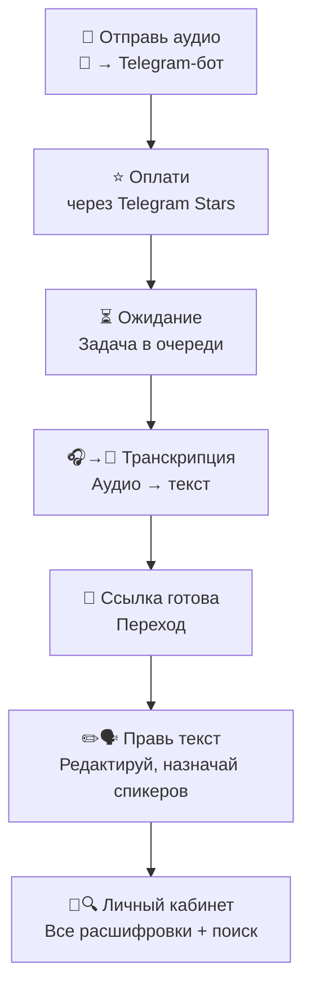

# LaterListener: сервис расшифровки звонков

## Наша миссия: освободить ваше внимание для сути разговора, без потери деталей

Главная ценность любого диалога — быть в нём на 100%. Когда вы думаете о том, как бы не упустить важное, вы уже не слушаете по-настоящему. Вы заняты фиксацией, а не пониманием. Это особенно критично в сложных, философских или просто глубоко личных беседах.

**LaterListener** возвращает вам эту роскошь — быть полностью погруженным в разговор, доверяя фиксацию деталей технологиям. Мы превращаем аудиозаписи в структурированный текст, чтобы вы могли:

- **Фиксировать договорённости:** Будьте уверены, что ни одна важная деталь не будет упущена и сохранится в точности.
- **Присутствовать в моменте:** Обсуждайте сложные темы, не отвлекаясь на записи. Фокусируйтесь на собеседнике, а не на конспекте.
- **Анализировать общение:** Возвращайтесь к диалогу, чтобы понять его структуру, свои реакции и аргументы собеседника.
- **Экономить время:** Быстро находите нужную информацию, не переслушивая часы аудио.

Мы создаём не просто транскрибатор, а инструмент для глубокого и осознанного общения.

## Суть проекта

Ключевая идея — дать пользователю возможность не думать о конспектировании во время разговора, а после — легко работать с его текстовой версией.

Сервис построен вокруг **Telegram-бота**, который выступает основной точкой входа. Вся логика работы:

1. Пользователь отправляет аудиофайл в нашего **Telegram-бота**.
2. Оплачивает обработку с помощью **Telegram Stars**.
3. Бот принимает файл, подтверждает оплату и ставит задачу на расшифровку в очередь.
4. После завершения транскрибации бот отправляет пользователю персональную **ссылку на веб-страницу**.
5. Пользователь переходит по ссылке, которая содержит временный токен для входа. Это обеспечивает бесшовную авторизацию на сайте по его Telegram ID без ввода логина и пароля.

На странице с результатом:

* Можно читать расшифровку
* Можно вручную редактировать текст, исправляя ошибки.
* Можно переименовать спикеров (Speaker #1 → «Иван Петров»).
* Можно сделать саммари и добавлять/убирать в нём детали с помощью нейронной сети.
* Есть доступ ко всем своим расшифровкам в личном кабинете.
* Работает минимальный поиск по текстам.
* Можно поделиться расшифровкой по вечной ссылке (в режиме «только для чтения»).

## Для кого этот проект (и почему он учебный)

**Важный контекст:** LaterListener — это в первую очередь открытый учебный проект. Мы создаем его, чтобы на практике отработать ключевые навыки, которые редко встретишь в теоретических курсах:

- **Ясность коммуникации:** Умение четко ставить задачи, договариваться об API и синхронизировать ожидания.
- **Командная работа:** Взаимодействие в распределенной команде с разными ролями (бэкенд, фронтенд, DevOps).
- **Работа с реальными инструментами:** Мы используем стек, востребованный в индустрии, чтобы участники получали актуальный опыт.

Этот проект — безопасная среда, где можно ошибаться, учиться и создавать работающий продукт. Мы приветствуем как опытных разработчиков, готовых делиться знаниями, так и новичков, которые хотят расти.

## Разделение на потоки работ

1. **Продукт и аналитика**: исследование рынка, формулирование гипотез, сбор метрик, развитие продукта.
2. **Маркетинг и сообщество**: продвижение проекта, привлечение пользователей и контрибьюторов.
3. **Telegram-бот и загрузка**: приём файла, оплата, запуск задачи.
4. **Очередь и транскрибация**: постановка задачи, прогресс, хранение результата.
5. **Просмотр и авторизация**: страница расшифровки, Telegram-логин, отображение.
6. **Редактирование**: изменение текста, спикеров, сохранение.
7. **Список и поиск**: доступ ко всем расшифровкам, поиск и фильтры.
8. **Шаринг**: генерация ссылки, ограничения, защита.

## Технологический стек (предварительный)

*   **Бэкенд**: Python (FastAPI), Go
*   **Фронтенд**: React, TypeScript, TailwindCSS
*   **Telegram-бот**: `aiogram`
*   **Транскрибация**: OpenAI Whisper, `pyannote.audio` для диаризации
*   **База данных**: PostgreSQL
*   **Очередь задач**: Celery
*   **Деплой**: Docker, Docker Compose, CI/CD (GitHub Actions)

## Сессия запуска (в Miro)

1. **Открытие (10 мин)** — презентация идеи и смысла.
2. **Общее поле (15 мин)** — накидывание модулей, декомпозиция.
3. **Группировка (15 мин)** — сортировка, формирование 5–6 направлений.
4. **Выбор команд (10 мин)** — по желанию или по готовому плану.
5. **Брейкаут-румы (30 мин)** — каждая команда:
   * описывает свой модуль,
   * выписывает API,
   * указывает зависимости,
   * формулирует первые шаги.
6. **Общий синк (20 мин)** — представление модулей и выявление стыков.

## Выходные артефакты

* Схема архитектуры (декомпозиция).
* Назначенные команды и зоны ответственности.
* Miro-доска с модульной структурой.
* Список API-интерфейсов и требований.
* План на первую итерацию.

## Распределение участников по ролям и направлениям

| Область           | Роль           | Описание                                                         |
| ----------------- | -------------- | ---------------------------------------------------------------- |
| Бэкенд            | Контрибьюторы  | Участники с опытом в Python, Go, Flask, Docker, C/C++, Java, SQL |
|                   | Архитектура    | Те, кто хочет выстраивать системную структуру                    |
| Фронтенд          | Интерфейс      | HTML/CSS, React, работа с адаптивом и подключение к API          |
| DevOps            | Инфраструктура | Docker, CI/CD, деплой, логгирование, настройка окружения         |
| Дизайн            | UI/UX          | Создание макетов, дизайн страниц                                 |
| Аналитика/Продукт | Продакты       | Фасилитация, формулировка метрик, сценарии пользователей         |
| Маркетинг         | Евангелисты    | Продвижение, работа с сообществом, создание контента             |

Участники распределяются по модулям с учётом их целей и опыта.

---
Всегда ваши, 
Миша и Ксюша